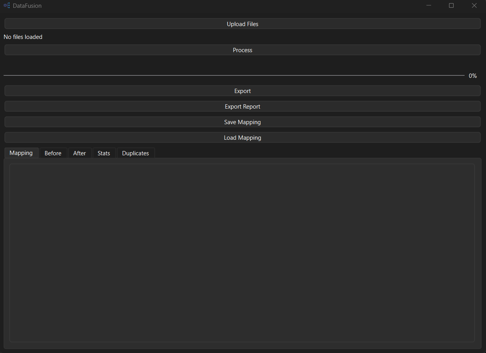
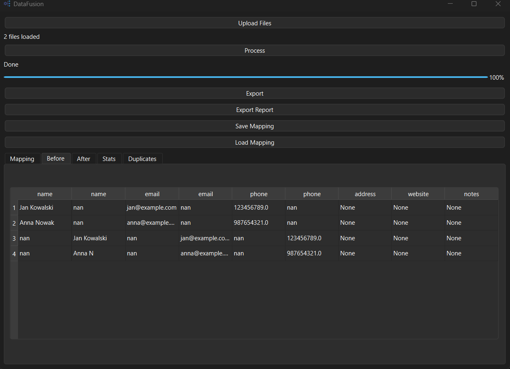
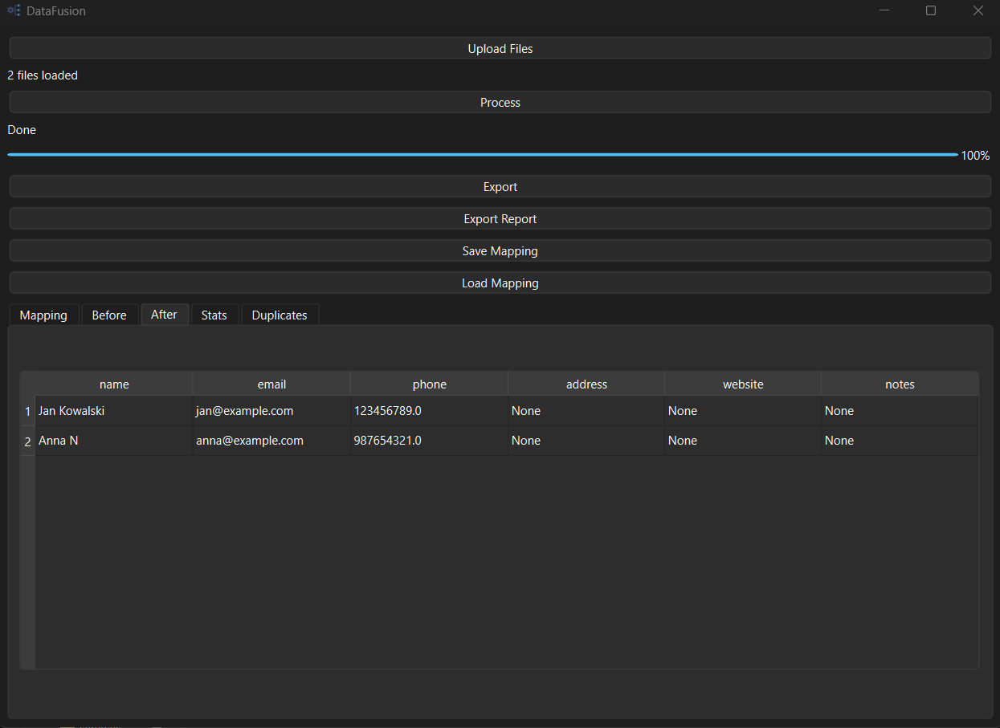

# DataFusion

**DataFusion** is a desktop ETL tool for merging, cleaning, and deduplicating data from multiple CSV and Excel files.

It is designed to solve a common business problem: scattered, inconsistent data coming from different sources.

---

## Features

*  Import multiple files (CSV, Excel)
*  Smart column mapping (auto + manual)
*  Save & load mapping configurations
*  Data cleaning and normalization
*  Advanced deduplication (email + fuzzy matching)
*  Intelligent record merging
*  Before / After data preview
*  Data quality report (JSON export)
*  Duplicate groups overview
*  Export results (CSV, Excel)

---

## How It Works

1. Load one or more data files
2. Map columns to a standard schema
3. Run processing
4. Review results (Before / After)
5. Export cleaned data

---

## Tech Stack

* Python
* PyQt6 (GUI)
* Pandas (data processing)

---

## Run Locally

```bash
pip install -r requirements.txt
python main.py
```

---

## Build Executable

```bash
pyinstaller --onefile --windowed --icon=icon.ico main.py
```

---

## Tabs Overview

* **Mapping** – configure column mapping
* **Before** – raw data after mapping
* **After** – cleaned and deduplicated data (editable)
* **Stats** – processing summary
* **Duplicates** – detected duplicate groups

---

## Screenshots

### Main Interface


### Before Processing


### After Processing


---

## Project Structure

```
datafusion/
│
├── core/        # core logic (cleaning, dedupe, merge)
├── services/    # pipeline & reporting
├── ui/          # PyQt GUI
├── storage/     # saved mappings
│
├── main.py
├── icon.ico
├── requirements.txt
├── README.md
└── .gitignore
```

---

## Use Cases

* Cleaning CRM exports
* Merging lead lists from multiple sources
* Removing duplicate contacts
* Preparing data for analysis or import

---

## Notes

* Email is treated as a unique identifier (hard match)
* The tool is optimized for datasets up to ~10,000 rows
* Designed as a practical, real-world data tool

---
